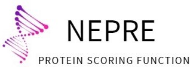

[LiuLab]() | [Document]() | [WebServer Link]() | [Nepre Potential]() | [Software Link]()

## NEPRE WEB APPLICATION
The webserver for **Nepre**.

## Develope Environment
* Python 2.7
* Django 1.11.14
* Jsmol
* Bootstrap

## Function
* Get amino pair distribution of different layers.
* Calculate the potential energy of a single or a series of PDB.

## Cache File Location
* ./uploadfiles
* ./predict/static/download/potential
* ./predict/static/pics
* ./predict/templates/temp
* ./predict/templates/results
* ./predict/templates/AADistribute
## CopyRight
Nepre-WebServer is created by **LiuLab** of **Beijing Computation Science Research Center(CSRC)**.

## Contact Us
**Email**: nepre2018@163.com  
**Address**: Building 9, East Zone, ZPark II, No.10 East Xibeiwang Road, Haidian District, Beijing 100193, China.